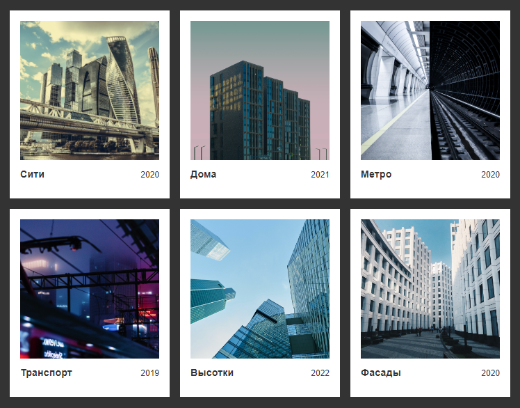

# Резиновая сетка с квадратными картинками

Предположим, у нас есть вот такие исходные фотографии:


Как видите, они с разным соотношением сторон: вертикальные, горизонтальные, квадратные (или «почти квадратные»).

Нужно получить вот такой результат:



При этом картинки должны остаться картинками (```img```): потому что так семантически верно и чтобы им можно было задать alt-атрибуты. В общем, вариант с выводом картинок через фон — не подходит.

Поскольку карточки резиновые, то мы заранее не знаем, какая высота и ширина должна быть у каждой картинки (она будет меняться в зависимости от размеров вьюпорта). Если высоту/ширину можно было задать жёстко в пикселях, то проблема стала бы тривиальной и решалась бы через задание примерно таких свойств для элемента-картинки (```img```):

```css
.gallery-item__photo {
  ...;
  width: 200px;
  height: 200px;
  object-fit: cover;
}
```

Если мы попытаемся установить для картинок ширину в 100%, то получим вот такой вариант:


А если ещё и высоту сделаем 100%, то получим такое:


Все картинки в ряду отмасштабировались по картинке с наибольшей высотой. Красивое! Но нам нужно, чтоб картинки были квадратными, а не вытянутыми по вертикали. К тому же, может получиться так, что в каком-то ряду попадутся только горизонтальные картинки, и тогда в таком ряду все карточку будут наоборот низкими.

Красивым решением является использование свойства ```aspect-ratio``` (даже ```object-fit: cover``` с ним не потребуется):

```css
.gallery-item__photo {
  ...;
  width: 100%;
  aspect-ratio: 1/1;
}
```

Но беда в том, что автотесты Яндекс.Практикума это свойство не принимают. Слишком свежее. Хотя по данным https://caniuse.com/mdn-css_properties_aspect-ratio все современные браузеры его уже поддерживают.


